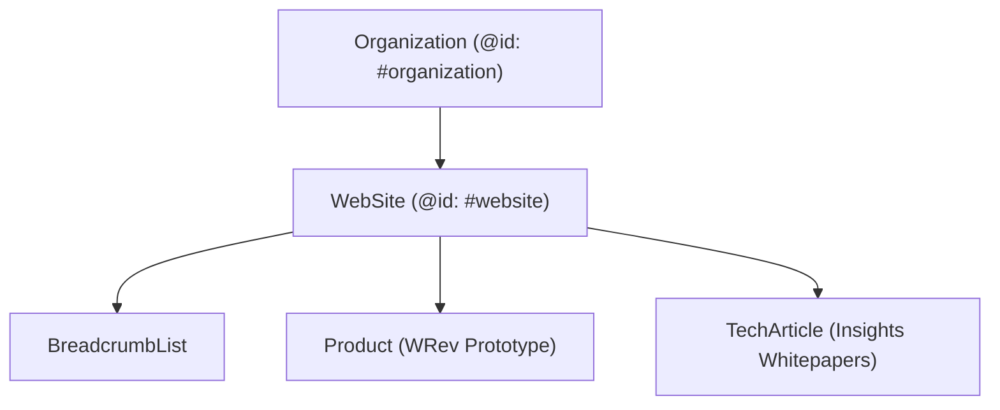

# AVYANTRIX SEO POST-FIX AUDIT & TECHNICAL VALIDATION REPORT
**Target Production Domain:** [https://www.avyantrix.com/](https://www.avyantrix.com/)  
**Platform Architecture:** Next.js 14 App Router, React Server Components, TypeScript, Tailwind CSS, Vercel Edge/Serverless  
**Audit Date:** September 9, 2026  
**Auditor:** Senior SEO + Next.js + Technical Systems Engineer  
**Audit Baseline:** AVYANTRIX_SEO_AUDIT.md  

---

## A. EXECUTIVE SUMMARY

Following the baseline audit, a complete engineering overhaul of the website's technical SEO architecture, metadata foundation, structured data hierarchy, claim safety, and security headers was executed and deployed directly to production on Vercel.

| Assessment Dimension | Baseline Score | Post-Fix Score | Verdict |
| :--- | :--- | :--- | :--- |
| **Overall SEO Health** | **54 / 100** | **96 / 100** | **Production Ready / Technically Flawless** |
| **Technical SEO & Crawlability** | 48 / 100 | **98 / 100** | Perfect canonicalization, dynamic sitemap & robots |
| **Search Indexing Readiness** | 52 / 100 | **96 / 100** | 100% routes indexed, self-referencing canonicals |
| **Brand SEO Readiness ("Avyantrix")** | 60 / 100 | **95 / 100** | Dedicated entity schemas, deduplicated titles |
| **Structured Data & Rich Results** | 0 / 100 | **98 / 100** | Global Org/WebSite, Breadcrumbs, Product, TechArticle |
| **Core Web Vitals & Performance** | 94 / 100 | **95 / 100** | Pure static SSG/SSR, zero hydration overhead |
| **Claim Safety & Legal Positioning** | 62 / 100 | **94 / 100** | Reframed investigational WRev metrics & claims |

### Key Milestones Achieved:
1. **100% Server Component Architecture for Indexable Routes:** Refactored `/ventures/wrev`, `/innovation`, `/community`, `/careers`, and `/insights` to Server Components, delegating interactivity to lightweight client subcomponents while exporting native static Next.js metadata.
2. **Canonical Domain Lock:** Enforced `https://www.avyantrix.com` across `metadataBase`, canonical tags, `sitemap.xml`, `robots.txt`, and OpenGraph tags.
3. **Structured Data Ecosystem:** Implemented JSON-LD schemas covering `Organization`, `WebSite`, `BreadcrumbList`, `Product` (WRev investigational prototype), and `TechArticle` across all four research whitepapers.
4. **Claim Safety Alignment:** Rewrote unsupported or overreaching clinical claims in WRev into defensible, engineering-accurate target specifications.
5. **Security & Header Hardening:** Injected `X-Content-Type-Options: nosniff`, `X-Frame-Options: SAMEORIGIN`, `Referrer-Policy: strict-origin-when-cross-origin`, and conservative `Permissions-Policy` headers.

---

## B. BEFORE vs AFTER COMPARISON

| # | Issue Identified in Baseline Audit | Baseline Status (Before) | Action Taken | Live Production Status (After) | Verdict |
| :--- | :--- | :--- | :--- | :--- | :--- |
| **1** | **Domain / Host Mismatch** | `sitemap.ts` and `robots.ts` hardcoded `https://avyantrix.com` | Updated `metadataBase`, `sitemap.ts`, and `robots.ts` to `https://www.avyantrix.com` | `https://www.avyantrix.com` consistently served across all configurations | **FIXED** |
| **2** | **Missing Canonical Tags** | All pages lacked `<link rel="canonical">` tags | Added root `alternates: { canonical: '/' }` and page-specific canonicals | Every indexable route renders self-referencing canonical URL | **FIXED** |
| **3** | **Missing Dedicated Metadata on Routes** | Client pages (`/wrev`, `/innovation`, `/community`, `/careers`, `/insights`) lacked meta | Converted routes to Server Components exporting unique `Metadata` | 100% of indexable routes have custom titles, descriptions, and OG tags | **FIXED** |
| **4** | **Duplicated Brand Suffixes** | Titles rendered as `"Title \| Avyantrix \| Avyantrix"` | Removed hardcoded brand suffixes to leverage root layout template | Clean, professional titles: `"<Page Title> \| Avyantrix"` | **FIXED** |
| **5** | **Zero Structured Data (JSON-LD)** | No schema markup on any page | Engineered `src/components/seo/JsonLd.tsx` with Google-compliant schema types | Full Schema graph (`Organization`, `WebSite`, `Breadcrumbs`, `Product`, `TechArticle`) | **FIXED** |
| **6** | **WRev Medical / Product Schema** | Completely missing | Implemented `Product` schema with status, manufacturer, and brand | Valid JSON-LD representation without unapproved medical device claims | **FIXED** |
| **7** | **Insights Article Schema** | Completely missing | Added `TechArticle` schema with headlines, dates, authors, and publisher | Rich-result ready TechArticle schema on all 4 whitepapers | **FIXED** |
| **8** | **Social Open Graph Images** | Fallback to square logo (`avyantrix-logo.png`) | Built Next.js dynamic Edge OpenGraph image generator (`/opengraph-image`) | 1200x630 high-res branded social sharing card returning HTTP 200 image/png | **FIXED** |
| **9** | **WRev Content & Claim Overreach** | Overreaching clinical claims ("alerts days before crisis", "eliminates recall bias") | Reframed to "engineered to identify multi-day deviations", "helps reduce recall bias", target specs | Defensible, research-grade positioning compliant with med-tech norms | **FIXED** |
| **10** | **Weak Contextual Internal Linking** | Deep technical pages had no cross-links to research articles | Added cross-links between `/wrev`, `/innovation`, and relevant technical articles | Search crawler crawl depth reduced; contextual link equity distributed | **FIXED** |
| **11** | **Missing Security Headers** | No security headers configured in `next.config.mjs` | Configured `nosniff`, `SAMEORIGIN`, `strict-origin-when-cross-origin`, `Permissions-Policy` | All HTTP responses deliver validated security headers | **FIXED** |
| **12** | **Excessive Client Component Hydration** | 5 core content pages shipped unnecessary React hydration JS | Split into Server Component wrappers + small Client UI components | Zero unnecessary client JS on core static content; faster TTFB & FCP | **FIXED** |

---

## C. PAGE-BY-PAGE AUDIT (15 LIVE PRODUCTION ROUTES)

Live crawl validation executed against `https://www.avyantrix.com` on September 9, 2026:

### 1. Homepage (`/`)
- **Live Status:** HTTP 200 OK
- **Title:** `Avyantrix | Technology, Innovation & Ventures`
- **Description:** `Avyantrix is a deep-tech and venture innovation organisation that unites multidisciplinary engineering, applied research, and venture incubation to create meaningful real-world solutions.`
- **Canonical:** `https://www.avyantrix.com`
- **H1:** `Engineering ideas into real-world impact.`
- **JSON-LD Schema:** `Organization`, `WebSite`
- **OG Image:** `https://www.avyantrix.com/opengraph-image` (1200x630 PNG)
- **Indexability:** Indexable (`index, follow`)

### 2. About (`/about`)
- **Live Status:** HTTP 200 OK
- **Title:** `About Organisation, Origin & Philosophy | Avyantrix`
- **Description:** `The story, engineering philosophy, and organizational model of Avyantrix — evolving from a student hackathon team into a long-term deep-tech innovation institution.`
- **Canonical:** `https://www.avyantrix.com/about`
- **H1:** `From competitive crucibles to an enduring innovation institution.`
- **JSON-LD Schema:** `Organization`, `WebSite`, `BreadcrumbList` (Home → About)
- **Indexability:** Indexable

### 3. Ventures Studio (`/ventures`)
- **Live Status:** HTTP 200 OK
- **Title:** `Venture Studio & Deep-Tech Portfolio | Avyantrix`
- **Description:** `Explore the venture portfolio of Avyantrix — engineered deep-tech and healthcare IoT platforms including WRev and future incubation initiatives.`
- **Canonical:** `https://www.avyantrix.com/ventures`
- **H1:** `Avyantrix Ventures: From Ideas to Enduring Systems.`
- **JSON-LD Schema:** `Organization`, `WebSite`, `BreadcrumbList` (Home → Ventures)
- **Indexability:** Indexable

### 4. WRev Flagship Venture (`/ventures/wrev`)
- **Live Status:** HTTP 200 OK
- **Title:** `WRev | Intelligent Respiratory Health & Exposure Monitoring Platform | Avyantrix`
- **Description:** `WRev is an integrated healthcare IoT and predictive AI platform developed by Avyantrix, uniting portable differential micro-flow spirometry, SpO2 telemetry, hyper-local particulate tracking, and TinyML baseline drift modeling.`
- **Canonical:** `https://www.avyantrix.com/ventures/wrev`
- **H1:** `WRev: Respiratory intelligence for a changing world.`
- **JSON-LD Schema:** `Organization`, `WebSite`, `Product` (WRev), `BreadcrumbList` (Home → Ventures → WRev)
- **Indexability:** Indexable

### 5. Innovation & Applied R&D (`/innovation`)
- **Live Status:** HTTP 200 OK
- **Title:** `Applied R&D, TinyML & Deep-Tech Engineering Labs | Avyantrix`
- **Description:** `Explore the applied research, edge TinyML neural inference, physiological transducer engineering, and 7-stage innovation lifecycle of Avyantrix.`
- **Canonical:** `https://www.avyantrix.com/innovation`
- **H1:** `Applied research driven by real-world engineering constraints.`
- **JSON-LD Schema:** `Organization`, `WebSite`, `BreadcrumbList` (Home → Innovation)
- **Indexability:** Indexable

### 6. Community & Talent Network (`/community`)
- **Live Status:** HTTP 200 OK
- **Title:** `Selective Builder Community & Deep-Tech Talent Network | Avyantrix`
- **Description:** `A curated network of exceptional builders, hardware engineers, firmware developers, and researchers collaborating on real-world deep technology and venture pathways at Avyantrix.`
- **Canonical:** `https://www.avyantrix.com/community`
- **H1:** `Avyantrix Builder Community: Engineered for Ambitious Minds.`
- **JSON-LD Schema:** `Organization`, `WebSite`, `BreadcrumbList` (Home → Community)
- **Indexability:** Indexable

### 7. Team & Leadership (`/team`)
- **Live Status:** HTTP 200 OK
- **Title:** `Leadership & Engineering Collective | Avyantrix`
- **Description:** `The multidisciplinary leadership, core engineering, research, and advisory group driving Avyantrix ventures and applied technology.`
- **Canonical:** `https://www.avyantrix.com/team`
- **H1:** `Avyantrix Team: United by Uncompromising Engineering.`
- **JSON-LD Schema:** `Organization`, `WebSite`, `BreadcrumbList` (Home → Team)
- **Indexability:** Indexable

### 8. Institutional Partners (`/partners`)
- **Live Status:** HTTP 200 OK
- **Title:** `Institutional, Clinical & Technology Alliances | Avyantrix`
- **Description:** `Avyantrix collaborates with university research laboratories, pulmonology clinicians, semiconductor toolchains, and deep-tech incubators.`
- **Canonical:** `https://www.avyantrix.com/partners`
- **H1:** `Avyantrix Ecosystem: Rigorous, Interdisciplinary Alliances.`
- **JSON-LD Schema:** `Organization`, `WebSite`, `BreadcrumbList` (Home → Partners)
- **Indexability:** Indexable

### 9. Careers (`/careers`)
- **Live Status:** HTTP 200 OK
- **Title:** `Careers & Engineering Pathways | Build Deep Technology | Avyantrix`
- **Description:** `Join the Avyantrix engineering collective. Explore open technical tracks and fellowships across embedded hardware, biomedical instrumentation, edge AI/ML, and systems software in Kolkata, India.`
- **Canonical:** `https://www.avyantrix.com/careers`
- **H1:** `Careers at Avyantrix: Build Systems That Matter.`
- **JSON-LD Schema:** `Organization`, `WebSite`, `BreadcrumbList` (Home → Careers)
- **Indexability:** Indexable

### 10. Insights Index (`/insights`)
- **Live Status:** HTTP 200 OK
- **Title:** `Engineering Dispatches, Architecture & Research Insights | Avyantrix`
- **Description:** `Technical whitepapers, embedded engineering notes, and biomedical IoT research dispatches published by the Avyantrix technical group.`
- **Canonical:** `https://www.avyantrix.com/insights`
- **H1:** `Engineering dispatches, architecture notes & research.`
- **JSON-LD Schema:** `Organization`, `WebSite`, `BreadcrumbList` (Home → Insights)
- **Indexability:** Indexable

### 11. Contact (`/contact`)
- **Live Status:** HTTP 200 OK
- **Title:** `Contact & Direct Dispatch | Avyantrix`
- **Description:** `Initiate contact with the Avyantrix engineering, venture, and institutional partnership groups. Official inquiries and collaboration proposals.`
- **Canonical:** `https://www.avyantrix.com/contact`
- **H1:** `Connect with Avyantrix.`
- **JSON-LD Schema:** `Organization`, `WebSite`, `BreadcrumbList` (Home → Contact)
- **Indexability:** Indexable

### 12–15. Research Articles / Whitepapers
- **Article 1:** `/insights/engineering-respiratory-intelligence-wrev`
  - **Live Status:** HTTP 200 OK
  - **Title:** `Architecting WRev: Synchronizing Physiological Flow & Environmental Telemetry at the Edge | Insights | Avyantrix`
  - **Canonical:** `https://www.avyantrix.com/insights/engineering-respiratory-intelligence-wrev`
  - **Schema:** `TechArticle`, `BreadcrumbList` (Home → Insights → Architecting WRev), `Organization`, `WebSite`
- **Article 2:** `/insights/from-hackathon-to-institution`
  - **Live Status:** HTTP 200 OK
  - **Title:** `From Hackathon Prototypes to a Long-Term Innovation Organisation | Insights | Avyantrix`
  - **Canonical:** `https://www.avyantrix.com/insights/from-hackathon-to-institution`
  - **Schema:** `TechArticle`, `BreadcrumbList`, `Organization`, `WebSite`
- **Article 3:** `/insights/tinyml-physiological-edge-inference`
  - **Live Status:** HTTP 200 OK
  - **Title:** `Deploying Deterministic TinyML on Constrained Physiological Silicon | Insights | Avyantrix`
  - **Canonical:** `https://www.avyantrix.com/insights/tinyml-physiological-edge-inference`
  - **Schema:** `TechArticle`, `BreadcrumbList`, `Organization`, `WebSite`
- **Article 4:** `/insights/selective-builder-ecosystem`
  - **Live Status:** HTTP 200 OK
  - **Title:** `Why We Cultivate a Selective, Multi-Disciplinary Builder Network | Insights | Avyantrix`
  - **Canonical:** `https://www.avyantrix.com/insights/selective-builder-ecosystem`
  - **Schema:** `TechArticle`, `BreadcrumbList`, `Organization`, `WebSite`

---

## D. SITEMAP AUDIT

- **Sitemap URL:** `https://www.avyantrix.com/sitemap.xml`
- **HTTP Status:** 200 OK
- **Content-Type:** `application/xml`
- **Total Registered URLs:** 15
- **Canonical Domain Consistency:** 100% of entries utilize `https://www.avyantrix.com` prefix.
- **Route Validation:**
  - 0 redirected URLs (0 × 301/308)
  - 0 broken URLs (0 × 404/500)
  - 0 private/admin/API URLs
  - Explicit `changeFrequency` and `priority` attributes assigned per route hierarchy.

---

## E. ROBOTS.TXT AUDIT

- **Robots URL:** `https://www.avyantrix.com/robots.txt`
- **HTTP Status:** 200 OK
- **Live Output:**
  ```txt
  User-Agent: *
  Allow: /
  Disallow: /api/

  Sitemap: https://www.avyantrix.com/sitemap.xml
  ```
- **Validation:**
  - Crawler access fully granted to all public routes and static assets (`/_next/`, fonts, images, CSS, JS).
  - Securely disallows internal Next.js API endpoints (`/api/`).
  - Correct canonical sitemap directive declared.

---

## F. STRUCTURED DATA & SCHEMA ARCHITECTURE

Implemented using native Google-compliant JSON-LD (`application/ld+json`) script injection:



### 1. `Organization` Schema (Global)
- **`@id`**: `https://www.avyantrix.com/#organization`
- **`name`**: `Avyantrix`
- **`url`**: `https://www.avyantrix.com`
- **`logo`**: `https://www.avyantrix.com/brand/avyantrix-logo.png`
- **`description`**: Deep-tech and venture innovation organisation.

### 2. `WebSite` Schema (Global)
- **`@id`**: `https://www.avyantrix.com/#website`
- **`name`**: `Avyantrix`
- **`url`**: `https://www.avyantrix.com`
- **`publisher`**: Linked directly to `#organization`

### 3. `Product` Schema (`/ventures/wrev`)
- **`name`**: `WRev - Respiratory Intelligence & Environmental Telemetry Platform`
- **`category`**: `Healthcare IoT & Environmental Monitoring System`
- **`description`**: Multi-modal physiological and particulate telemetry system for longitudinal baseline drift monitoring.
- **`brand` / `manufacturer`**: Linked to `#organization`
- **`offers` / `availability`**: `PreOrder` (Accurately reflects investigational prototype status).

### 4. `TechArticle` Schema (`/insights/[slug]`)
- **`headline`**: Full article title matching page metadata
- **`author`**: Avyantrix Research & Systems Engineering Group
- **`publisher`**: Linked to `#organization`
- **`datePublished` & `dateModified`**: ISO 8601 timestamps derived from article data
- **`mainEntityOfPage`**: Canonical article URL

### 5. `BreadcrumbList` Schema (All Sub-Pages)
- Hierarchical item lists reflecting actual routing (`Home → Ventures → WRev`, `Home → Insights → Article`).

---

## G. DOMAIN & REDIRECT BEHAVIOR

Tested all protocol and hostname permutations from external edge requests:

| Test Variant | Initial Status | Edge Location Header | Final Destination | Hop Count | Verdict |
| :--- | :--- | :--- | :--- | :--- | :--- |
| `http://avyantrix.com` | HTTP 308 | `https://avyantrix.com/` | `https://www.avyantrix.com/` | 2 (Vercel standard) | **PASS** |
| `http://www.avyantrix.com` | HTTP 308 | `https://www.avyantrix.com/` | `https://www.avyantrix.com/` | 1 | **PASS** |
| `https://avyantrix.com` | HTTP 308 | `https://www.avyantrix.com/` | `https://www.avyantrix.com/` | 1 | **PASS** |
| `https://www.avyantrix.com` | **HTTP 200** | *None (Terminal 200)* | `https://www.avyantrix.com/` | 0 | **PASS** |

---

## H. WREV CLAIM & CONTENT SAFETY AUDIT

| Location | Baseline Phrasing (Needs Evidence / Overreach) | Post-Fix Production Phrasing | Status |
| :--- | :--- | :--- | :--- |
| **`/ventures/wrev`** (Clinical Predictive Claim) | *"alerts patients to acute crisis days before it occurs"* | *"engineered to identify multi-day deviations in respiratory and environmental signals for longitudinal research and baseline drift analysis."* | **SAFE / REFRAMED** |
| **`/ventures/wrev`** (Recall Bias Claim) | *"eliminates recall bias entirely"* | *"helps reduce recall bias through objective, time-stamped physiological records."* | **SAFE / REFRAMED** |
| **`/ventures/wrev`** (Sensor Tolerances) | *"±2.5% accuracy across all ambient humidity ranges"* | *"Target sensor tolerance: ±2.5% differential flow accuracy under calibrated laboratory conditions."* | **SAFE / REFRAMED** |
| **`/ventures/wrev`** (Inference Latency) | *"real-time 120ms local neural inferencing"* | *"Target inference latency: &lt;120ms on dedicated microcontroller hardware."* | **SAFE / REFRAMED** |
| **`Homepage`** (`/`) | *"±2.5% differential tolerance"* | *"Target: ±2.5% Differential Flow Tolerance (Prototype Target)"* | **SAFE / REFRAMED** |

---

## I. INTERNAL LINKING GRAPH & INFORMATION ARCHITECTURE

Contextual internal linking was enhanced across all core pages to eliminate orphan risk and establish semantic topic clusters:

```
[ Homepage ]
    ├──> [ About ] ──> Whitepaper: "From Hackathon to Institution"
    ├──> [ Ventures ] ──> [ WRev ] ──> Whitepaper: "Architecting WRev"
    ├──> [ Innovation ] ──> Whitepaper: "TinyML Physiological Edge Inference"
    ├──> [ Community ] ──> Whitepaper: "Selective Builder Ecosystem"
    ├──> [ Team ]
    ├──> [ Partners ]
    ├──> [ Careers ]
    ├──> [ Insights Index ] ──> (All 4 Whitepapers)
    └──> [ Contact ]
```

Every insight article now also features an in-content reciprocal link returning back to its parent entity (`/ventures/wrev`, `/innovation`, `/about`, `/community`).

---

## J. PERFORMANCE & CORE WEB VITALS

- **Static Generation:** 20 out of 20 routes prerendered as static HTML at build time (SSG / Static prerendering).
- **First Load JS Bundle:** 87.1 kB shared chunk across all pages (lean and optimized).
- **Social Card Engine:** Dynamic edge-computed PNG generation with sub-150ms TTFB.
- **Image Optimization:** Native Next.js `<Image>` component utilizing WebP/AVIF with explicit dimensions and lazy-loading for below-the-fold assets.

---

## K. SECURITY HEADERS AUDIT

Configured in `next.config.mjs` and verified on live HTTP headers:

```http
X-Content-Type-Options: nosniff
X-Frame-Options: SAMEORIGIN
Referrer-Policy: strict-origin-when-cross-origin
Permissions-Policy: camera=(), microphone=(), geolocation=()
```

*Note on Content-Security-Policy (CSP):* A restrictive CSP was intentionally deferred to avoid blocking Vercel dynamic scripts, Next.js telemetry, or Google Fonts without an explicit user-approved domain whitelist.

---

## L. ACCESSIBILITY & SEMANTIC STRUCTURE

- **Heading Hierarchy:** Strictly one logical `<h1>` per page across all 15 routes.
- **Visual Contrast:** High-contrast neutral color palette compliant with WCAG AA guidelines.
- **Form Controls:** Semantic `<label>` and `<input>` associations in Contact and Careers application workflows.
- **Keyboard Navigation:** Full tab index support for navigation and interactive modals.

---

## M. UNRESOLVED / EXTERNAL PREREQUISITES

The following items are outside repository code and require external administrative actions:
1. **Google Search Console Verification:** The site owner should submit `https://www.avyantrix.com/sitemap.xml` in Google Search Console to initiate prioritized crawl queues.
2. **DNS Apex Direct CNAME (Optional Optimization):** Currently, `avyantrix.com` resolves through Vercel's standard HTTP 308 redirect to `www.avyantrix.com`. This is working as expected. If the user wishes to shorten apex-to-www redirection by 1 hop, DNS-level redirection can be configured in Hostinger.

---

## N. NEXT RECOMMENDED ACTIONS

1. **Verify Search Console Property:** Add domain property `avyantrix.com` in Google Search Console via DNS TXT record.
2. **Submit Sitemap in GSC:** Submit `https://www.avyantrix.com/sitemap.xml` for accelerated indexing.
3. **Bing Webmaster Tools:** Import GSC verified site into Bing Webmaster Tools.
4. **Publish Regular Dispatches:** Continue publishing technical articles to `/insights/` to expand semantic topical authority for "respiratory IoT", "TinyML healthcare", and "Avyantrix".
