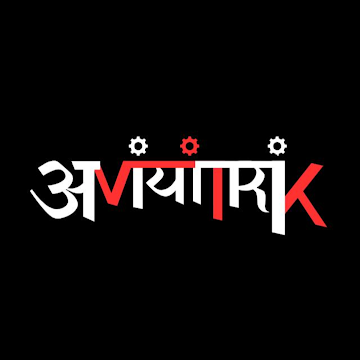

<div align="center">

  

  # AVYANTRIX
  ### Technology • Innovation • Ventures

  [](https://avyantrix.com)
  [](https://nextjs.org/)
  [](https://www.typescriptlang.org/)
  [](https://tailwindcss.com/)
  [](LICENSE)

  <p align="center">
    <strong>The official web platform and venture architecture for Avyantrix.</strong><br />
    Uniting exceptional builders, systems engineering, applied research, and physical computing to build meaningful, lasting solutions.
  </p>

</div>

---

## 🏛️ Executive Overview

**Avyantrix** is an applied technology and venture creation organisation originally forged in competitive student engineering hackathons and evolved into an enduring innovation institution. 

We bridge the gap between theoretical research, custom physical hardware, and scalable commercial spin-offs. We deliberately focus on complex, foundational problems in healthcare telemetry, environmental sensing, and edge computing that demand multi-year technical discipline.

---

## 🌐 Four-Pillar Ecosystem Topology

The Avyantrix organisation operates across four synchronized pillars:

```
                               ┌────────────────────────────────┐
                               │     AVYANTRIX ORGANISATION     │
                               │   Research & Venture Studio    │
                               └───────────────┬────────────────┘
                                               │
        ┌──────────────────────┬───────────────┴──────────────┬──────────────────────┐
        │                      │                              │                      │
        ▼                      ▼                              ▼                      ▼
┌──────────────┐       ┌──────────────┐               ┌──────────────┐       ┌──────────────┐
│  01 VENTURES │       │02 INNOVATION │               │ 03 COMMUNITY │       │04 ALLIANCES  │
│  Product     │       │  Applied R&D │               │  Selective   │       │  Academic &  │
│  Spin-Offs   │       │  & TinyML    │               │  Builders    │       │  Clinical    │
└───────┬──────┘       └──────────────┘               └──────────────┘       └──────────────┘
        │
        ▼
 ┌──────────────┐
 │ WRev Health  │
 │  Platform    │
 └──────────────┘
```

1. **Ventures**: Incubating standalone technology products with dedicated regulatory and market paths.
2. **Innovation**: Conducting applied laboratory bench research, sensor physics characterization, and on-chip TinyML neural optimization.
3. **Community**: Curating a selective network of high-caliber builders across embedded systems, biomedical software, and industrial design.
4. **Alliances**: Collaborating with university laboratories, clinical investigators, semiconductor vendors, and deep-tech incubators.

---

## 🫁 Flagship Venture: WRev Platform

**WRev** is an integrated physiological and environmental respiratory intelligence system:

* **Differential Pressure Spirometry**: 200 Hz micro-venturi flow chamber delivering $\pm 2.5\%$ FEV1/FVC volumetric accuracy.
* **Dual-Wavelength Optical PPG**: Ambulatory $SpO_2$ (660nm / 940nm) with microvascular pulse transit timing and motion artifact cancellation.
* **Laser Aerosol Scattering Cavity**: Continuous micro-zone $PM_{2.5}$ and $PM_{10}$ particulate exposure monitoring.
* **On-Chip TinyML Inference**: Deterministic INT8 quantized neural model running on ARM Cortex-M4 silicon within a 164 KB static SRAM budget.

---

## 🛠️ Technology Stack

| Layer | Technology | Rationale |
| :--- | :--- | :--- |
| **Framework** | Next.js 14 (App Router) | High-performance React framework with static generation (SSG) & SEO optimization |
| **Language** | TypeScript 5.4 | Strict type safety across all system data layers and venture schemas |
| **Styling** | Tailwind CSS 3.4 + Custom Tokens | Minimalist, high-contrast design system tailored to brand red (`#ef233c`), black, and white |
| **Icons** | Lucide React | Clean, lightweight geometric iconography |
| **Package Manager**| pnpm | Fast, deterministic disk-efficient dependency management |

---

## 📁 Repository Structure

```
avyantrix/
├── public/
│   ├── brand/
│   │   └── avyantrix-logo.png    # Official Avyantrix Logo
│   ├── favicon.png               # Official Browser Favicon
│   └── logo.png                  # Brand Logo Asset
├── src/
│   ├── app/                      # Next.js App Router Multi-Page Architecture
│   │   ├── about/                # Genesis, Mission, 5 Beliefs & Timeline
│   │   ├── careers/              # Filterable Open Engineering Roles
│   │   ├── community/            # Selective Builder Network & Intake Form
│   │   ├── contact/              # Enterprise Routing Contact Form
│   │   ├── innovation/           # 7-Stage R&D Pipeline & Whitepaper Archive
│   │   ├── insights/             # Engineering & Architecture Dispatches
│   │   │   └── [slug]/           # Dynamic Article Reader
│   │   ├── partners/             # Academic, Clinical & Incubation Ecosystem
│   │   ├── team/                 # Systems Leadership, Advisors & Registry
│   │   ├── ventures/             # Venture Portfolio
│   │   │   └── wrev/             # Flagship WRev Deep-Dive & Architecture
│   │   ├── globals.css           # Brand Tokens, Gridlines & Theme Rules
│   │   ├── layout.tsx            # Root Layout with Header, Footer & Theme Provider
│   │   ├── not-found.tsx         # Branded 404 Error State
│   │   ├── page.tsx              # Homepage with Systems Overview & Ledger
│   │   ├── robots.ts             # SEO Crawl Configuration
│   │   └── sitemap.ts            # Dynamic Search Engine Sitemap
│   ├── components/
│   │   ├── layout/               # Global Header & Multi-Column Enterprise Footer
│   │   └── ui/                   # Modular UI & Custom Visualization Components
│   ├── context/
│   │   └── ThemeContext.tsx      # Dual-Theme System (Dark / Brand-Matched Light)
│   ├── data/                     # Decoupled, Strongly-Typed Data Matrix
│   │   ├── careers.ts
│   │   ├── community.ts
│   │   ├── innovation.ts
│   │   ├── insights.ts
│   │   ├── navigation.ts
│   │   ├── partners.ts
│   │   ├── team.ts
│   │   ├── timeline.ts
│   │   └── ventures.ts
│   ├── lib/
│   │   └── utils.ts              # Tailwind Class Merging & Utilities
│   └── types/
│       └── index.ts              # Global TypeScript Interface Definitions
├── .gitignore                    # Git Exclusion Rules
├── LICENSE                       # Proprietary Enterprise License
├── next.config.mjs               # Next.js Build Configuration
├── package.json                  # Dependencies & Project Scripts
├── pnpm-lock.yaml                # Lockfile
├── README.md                     # Organization & Architecture Documentation
├── tailwind.config.ts            # Tailwind Custom Token Matrix
└── tsconfig.json                 # TypeScript Configuration
```

---

## 🚀 Quick Start & Development

### Prerequisites
* **Node.js**: v18.17.0 or later
* **pnpm**: v8.0.0 or later (`npm install -g pnpm`)

### Installation
```bash
# Clone repository
git clone https://github.com/Debsmit16/avyantrix.git
cd avyantrix

# Install dependencies
pnpm install

# Start local development server
pnpm run dev
```

Open [http://localhost:3000](http://localhost:3000) in your browser to view the application.

### Production Build
```bash
# Build optimized static distribution
pnpm run build

# Preview production build locally
pnpm run start
```

---

## 🎨 Design System & Theme Principles

The web interface reflects a modern industrial design language:
* **Dark Mode**: Deep obsidian (`#07080a`), titanium card surfaces (`#12151d`), and precision borders (`rgba(255, 255, 255, 0.08)`).
* **Light Mode**: Logo-matched crisp off-white (`#ffffff` / `#f8fafc`), high-contrast charcoal text (`#0f172a`), and clean hairline division.
* **Brand Crimson**: Accentuated with Avyantrix Red (`#ef233c`).
* **Official Logo**: The official logotype synthesizes mechanical gear iconography with Bengali typographic heritage.

---

## 🤝 Community & Collaboration

We welcome inquiries from researchers, clinical investigators, and builders:
* **Builder Intake**: [Apply to Join the Community](https://avyantrix.com/community)
* **Clinical Collaboration**: [Inquire for WRev Pilot Trials](https://avyantrix.com/contact?topic=wrev)
* **Institutional Partnerships**: [Partner Frameworks](https://avyantrix.com/partners)

---

## ⚖️ Copyright & Intellectual Property

```
Copyright (c) 2023–2026 Avyantrix. All Rights Reserved.
```

All software, firmware architectures, hardware schematics, transducer specifications, brand assets, logos, and textual content contained within this repository are the exclusive intellectual property of **Avyantrix** and its respective venture divisions.

* **Trademark Notice**: `AVYANTRIX`, the Avyantrix logotype, and `WRev` are trademarks of Avyantrix.
* **Unauthorized Usage**: No part of this codebase, design assets, or technical documentation may be reproduced, distributed, or transmitted in any form without prior written authorization from Avyantrix.

See [LICENSE](LICENSE) for full legal terms.

---

<div align="center">
  <sub>Designed and engineered by the <strong>Avyantrix</strong> group • Kolkata, India</sub>
</div>
